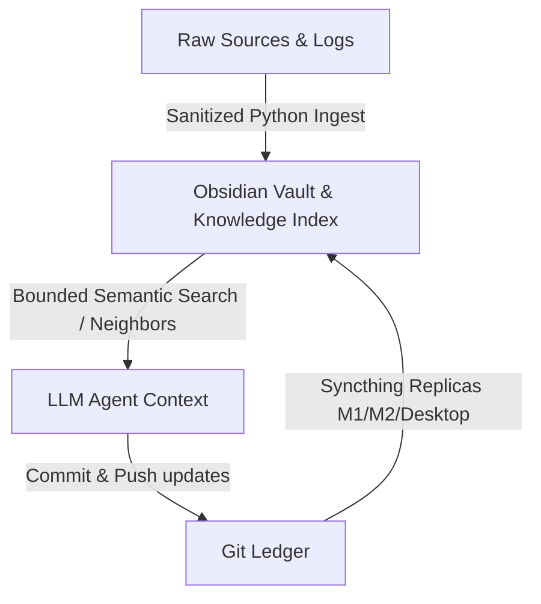

# Starship: Persistent Multi-Node LLM-Wiki Memory Blueprint

A production-proven blueprint for building and maintaining a local, persistent, and compounding knowledge base (LLM-Wiki) across multiple physical nodes.

This project provides a robust solution for two major production challenges in agentic workflows: **multi-device synchronization** (using Syncthing + Git) and **token economy** (using static metadata indexing to prevent context explosion).

---

## 🛰️ The Architecture

Unlike traditional RAG systems that query documents on the fly and force the LLM to re-evaluate concepts at every turn, this architecture treats the LLM as a **programmer** that maintains an active codebase of knowledge (the Wiki) in Obsidian.



### Core Layers

1. **Obsidian (The Human IDE):** The user browses, edits, and interacts with the knowledge base via Obsidian. All files are standard local Markdown with `[[wikilinks]]`.
2. **Engram / Knowledge Index (The Agent Index):** Instead of feeding the whole vault to the LLM, a compact index contains metadata and summaries. The LLM checks this index first to identify which pages to read.
3. **Git (The Ledger & Safety Net):** Every major edit by the agent is committed. If the LLM corrupts a page, a simple `git revert` restores the context. Sychronization across nodes is handled via Git SSH pushes and real-time folder syncing (Syncthing).

---

## 🧠 Solving the "Token Burn" Problem (LMC vs. Traditional Approaches)

In standard agentic memory or naive RAG workflows, the LLM is forced to read massive directories of markdown files or scan the entire knowledge base to understand context. This causes two major issues in production:
1. **Context Explosion (Token Burn):** Costs skyrocket and context windows fill up with redundant information.
2. **Knowledge Drift:** The agent gets confused by stale, long-form notes that might contradict newer developments.

### The LMC Solution: Local Metadata Indexing
This blueprint solves this by introducing a local-first **index-driven memory retrieval** pattern:
* **The Index:** A highly optimized, lightweight metadata index containing only node summaries, tags, and last-updated timestamps (managed via Engram/KIs).
* **Targeted Recall:** When queried, the agent *first* checks this compact index file. It identifies only the specific files containing the relevant concept or entity, and loads *only* those files.
* **Result:** Near-zero token waste, faster reasoning cycles, and precise context injection.

---

## 🛠️ Included Tools

* **`AGENTS.md`**: The system instructions that dictate how the LLM should act as a disciplined wiki maintainer (how to create pages, handle contradictions, and link notes).
* **`scripts/obsidian_sync_transcript.py`**: A Python script that extracts the active IDE session chat transcript and merges it into daily Obsidian journals under marker tags.
* **`scripts/obsidian_log.py`**: A helper script to append structured logs to Obsidian.
* **`scripts/wiki_linter.py`**: A health checker that finds orphan notes, YAML metadata discrepancies, and alerts on potential knowledge drift.

---

## 🚀 Getting Started

### 1. Structure your Vault
Create the following structure in your local project or Obsidian vault:
```text
my-vault/
├── raw/               # Immutable raw documents, PDFs, media
├── wiki/              # LLM-maintained pages
│   ├── index.md       # Content catalog
│   ├── log.md         # chronological operations log
│   ├── concepts/      # Generalized topic pages
│   └── entities/      # Tools, databases, organizations
└── AGENTS.md          # Agent system instructions
```

### 2. Configure the Sync Script
Configure the system paths in `scripts/obsidian_sync_transcript.py` or export the vault root as an environment variable:
```bash
export OBSIDIAN_VAULT_PATH="~/Documents/MyVault"
```

Run the sync script to import your active terminal agent sessions:
```bash
python3 scripts/obsidian_sync_transcript.py
```

### 3. Run the Health Check (Linter)
Keep your knowledge graph clean:
```bash
python3 scripts/wiki_linter.py
```

---

## 🛡️ License

This project is licensed under the Elastic License 2.0 (ELv2). See the [LICENSE](LICENSE) file for the full license text.
